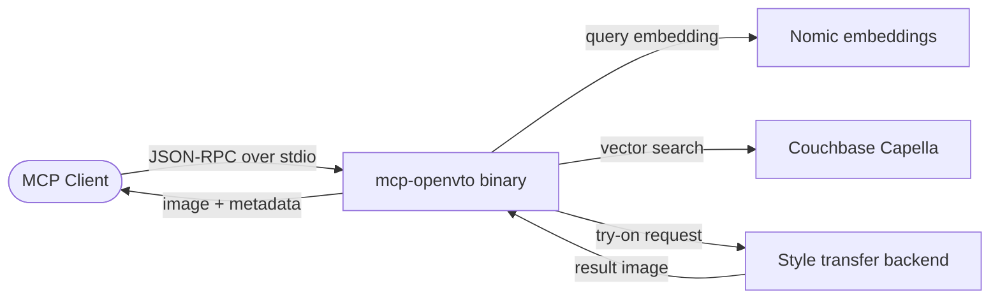

I have been building MCP servers for a while and one thing keeps annoying me: the dependency bloat. My first attempt, `mcp-local-rag`, did what it promised. It served web searched through the Model Context Protocol and it worked. But shipping it meant dragging along a Docker image that weighed about 1.2GB. For a tool that is basically a JSON-over-stdio pipe, that felt absurd.

It left me with a question I could not shake: how small can an MCP server actually be?

The talk was at the AI Tinkerers Dubai June 2025 meetup.

## The hackathon: building a virtual try-on app

A few months later, my team won the AI Tinkerers Dubai hackathon with a fashion recommendation and virtual try-on system. The idea was straightforward: let someone describe what they want to wear, find matching items from a catalog, and then render the chosen garment onto their own photo.

We used a subset of 2,000 images from the Fashion Image Dataset. Each item had metadata like category, color, and style notes. We generated text embeddings from that metadata using Nomic embeddings through Ollama, then stored those vectors in Couchbase Capella. That gave us semantic vector search over the catalog. A user typed a natural language query like "casual blue summer dress" and Couchbase returned the closest matches without needing exact keyword matches.

The matching items fed a downstream style-transfer task that overlaid the garment onto a user-provided image. The result was a personalized, immersive shopping experience: describe a look, pick a piece, see it on yourself.

| Component       | Tech                         |
| --------------- | ---------------------------- |
| Embeddings      | Nomic via Ollama             |
| Vector store    | Couchbase Capella            |
| Try-on model    | Generative style transfer    |
| Dataset         | Fashion Image Dataset subset |
| Query interface | Natural language             |

The system worked well enough to win, but the runtime was heavy. Python, PyTorch, transformers, and the generative model dependencies added up fast. That is fine for a hackathon demo, but it is not what you want to ship as a reusable protocol adapter.

## The question: how low can you go?

MCP is not complicated at its core. A server reads JSON-RPC messages from stdin, handles a few lifecycle methods, and exposes tools that return more JSON. The protocol is transport-agnostic, but most servers use stdio. That means the ideal server is just a small binary that speaks JSON and calls into whatever backend it needs.

The contrast was painful. `mcp-local-rag` needed a 1.2GB Docker layer just to sit in the protocol. Most of that weight was Python, mediapipe libraries, ONNX, numpy, and the usual scientific-computing stack. Those are fine for model training and notebooks, but they are massive overkill for a protocol adapter.

I wanted to see what happened if I wrote the MCP layer in C++ and linked everything statically. No interpreter. No virtual environment. No transitive dependency graph. Just a single binary.

## mcp-openvto

I took the virtual try-on app and rewrote the MCP-facing part in C++. The result is [`mcp-openvto`](https://github.com/nkapila6/mcp-openvto). It exposes the same try-on workflow as tools over MCP, and the entire server compiles down to a single binary.

The binary size? 1.3MB.

That number still feels fake. We went from 1.2GB of Docker dependencies to a 1.3MB standalone binary. The C++ server handles JSON-RPC parsing, tool registration, and dispatch to the inference backend. The heavy generative model still lives somewhere else, but the protocol adapter itself is tiny.

> [!INFO]
> 1.3MB is the statically linked MCP server binary. The style-transfer model weights are not bundled inside it, but the protocol surface is complete and self-contained.

Practically, this changes how you deploy. You can drop the binary onto a machine, point it at the model endpoint or local weights, and connect it to any MCP client. There is no container to warm up, no conda environment to break, and no dependency conflicts when a transitive library updates.

The protocol is implemented by hand. No SDK needed. Once you parse the MCP handshake and the tool-call envelope, the rest is just routing JSON.

| Version              | Size   | Form            |
| -------------------- | ------ | --------------- |
| Python + Docker deps | ~1.2GB | Container image |
| C++ MCP server       | ~1.3MB | Static binary   |

That gap is almost three orders of magnitude, and it comes from removing the runtime and dependency tree rather than from any clever compression.

## The talk

I presented this at the [AI Tinkerers Dubai June 2025 Demo Day](https://dubai.aitinkerers.org/p/ai-tinkerers-dubai-meetup-june-2025-demo-day). The [talk page](https://dubai.aitinkerers.org/talks/rsvp_tx1DM2AilnQ) has the session details.

I covered the hackathon project, the decision to port the MCP layer to C++, the 1.2GB-to-1.3MB comparison, and a quick walkthrough of the binary. The room was full of people building AI tooling, so the questions were sharp: how do you handle model distribution, what about cross-platform builds, does static linking cause issues with certain dependencies? Those are all fair concerns, and they are the next layer of problems after you prove the footprint can be this small.

## What I learned

A few takeaways from this experiment:

1. **Compiled languages dramatically reduce the footprint of a protocol adapter.** Python is productive, but for a thin MCP server the runtime and dependency tree dominate the size. C++ flips that. The code you write is most of the binary.

2. **MCP is simple enough to implement from scratch.** The spec is not large. JSON-RPC framing, initialization, tool listing, and tool calls are all you need for a working server. Writing it in C++ forced me to understand the spec instead of relying on a high-level SDK, and that made the final binary smaller and more predictable.

3. **The protocol does not care about the language.** An MCP client treats a 1.3MB C++ binary the same way it treats a Python server with a 1.2GB Docker image. The contract is the same. The language is an implementation detail.

4. **Python is still the right choice for prototyping.** The hackathon app moved fast because Python has great libraries for embeddings, vector search, and generative models. I would prototype the same way again. But once the surface stabilizes, the C++ version is what I would ship.

5. **The real savings are operational.** A 1.3MB binary starts instantly, ships easily, and has a tiny attack surface. Container registries, cold starts, and dependency drift mostly disappear. That matters more than the raw number.

## Changelog

- [28.06.2025] Init.
