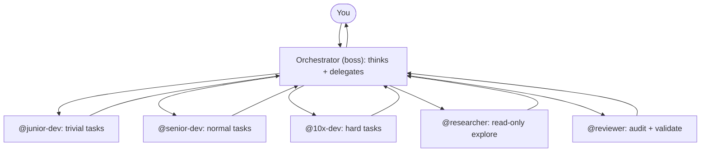

So you installed OpenCode! You typed your first prompt. It worked. Then you realized: this is just a chat interface with file access. You're still doing all the thinking, all the routing, all the context management.

That's the default experience. It's fine if you like playing prompt-engineer for 4 hours a day. But it's not actually _engineering_.

I spent a few hours building a config that turns OpenCode from a chat-with-files into a proper engineering organization. A boss, five workers, custom tools, custom commands, a compaction plugin, and a set of global rules that make every agent sound like a human instead of a marketing brochure.

This post is the full walkthrough of that config. Every file, every decision, every tradeoff. If you use OpenCode, steal what works.

> [!INFO] TL;DR
> TL;DR of the config below: one orchestrator (boss) delegates to five subagents (junior-dev, senior-dev, 10x-dev, researcher, reviewer), each with a specific model and locked-down permissions. Custom tools, custom commands, a compaction plugin, and a global rules file tie it together. Skip to The Cast of Characters if you just want the agent list.

> [!WARNING] This is opinionated
> I built this for how I work. You might hate it. That's fine. The patterns are what matter, not the specifics.

## The Big Picture: Boss-Worker Architecture

The idea is just: one agent _thinks_, others do the grunt work. The orchestrator (the boss) never writes code. It understands the problem, breaks it into tasks, routes each task to the right subagent, and synthesizes the results.



Why delegation beats doing everything yourself:

- **The boss stays focused.** It doesn't get distracted by implementation details. It thinks about the problem, not the syntax.
- **Workers are specialized.** Junior-dev is cheap and fast for boilerplate. 10x-dev is expensive but handles architecture. Researcher is read-only and costs almost nothing.
- **Parallelism.** The boss can run up to 2 subagents at once (the plan caps concurrent agents at 3, and the boss counts as 1). Independent tasks run in parallel, dependent ones sequence.
- **Context isolation.** Each subagent gets a self-contained prompt. They don't share the boss's context. This means no context bleed, no hallucinated assumptions, no "I thought you already knew about that file."

The routing logic is straightforward:

| Task type                                   | Subagent   | Model                | Cost      |
| ------------------------------------------- | ---------- | -------------------- | --------- |
| Trivial (one-line fix, rename, boilerplate) | junior-dev | devstral-small-2:24b | cheapest  |
| Normal (implement a function, fix a bug)    | senior-dev | deepseek-v4-flash    | medium    |
| Hard (multi-file refactor, architecture)    | 10x-dev    | kimi-k2.7-code       | expensive |
| Read-only (find, grep, summarize)           | researcher | devstral-small-2:24b | cheapest  |
| Review (audit, validate, sanity-check)      | reviewer   | gemma4:31b           | medium    |

The reviewer uses a _different model architecture_ (Gemma) than the devs (DeepSeek/Kimi) specifically to catch issues the dev models might miss. Different models make different mistakes. It's the only way to actually trust the output.

These are the models I'm using based on the Ollama Cloud $20/month subscription I have. I picked these based on benchmarks, cost, and release date, mostly focusing on the latter.

## Why These Models

Model selection is the part where the config actually gets opinionated. The wrong model in the wrong slot is _worse than no config at all_.

**Devstral Small 2 24B for junior-dev and researcher.** This is the cheapest model on Ollama Cloud. It's small enough to be fast, big enough to follow instructions and read code. I would not trust it with architecture decisions, but for "find every file that imports X" or "rename this variable" it's perfect. The researcher runs at temperature 0 because I want deterministic search results, not creative interpretations of what files exist.

**DeepSeek v4 Flash for senior-dev.** The workhorse. DeepSeek v4 Flash hits a sweet spot: strong enough for real implementation work, cheap enough that I don't think twice about spawning it. It follows existing patterns well, catches edge cases, and verifies its own work with lint/typecheck. If it can't handle something, it escalates up.

**Kimi K2.7 Code for 10x-dev.** The expensive slot. Kimi is purpose-built for code and it shows. It handles multi-file refactors, complex architectural decisions, and hard logic that makes senior-dev struggle. I use this sparingly because it's the most expensive model in the config, but when I need it, I need it. It also has a thinking mode that lets it reason through problems before writing code.

**Gemma 4 31B for reviewer.** This is the deliberate mismatch. The devs all run DeepSeek or Kimi. The reviewer runs Gemma. Different model families, different training data, different failure modes. If DeepSeek has a blind spot, there's a decent chance Gemma catches it. Temperature 0 because I want consistent reviews, not ones that vary by mood. I'm biased because I did it. Sue me.

**DeepSeek v4 Flash for socratic at temperature 0.3.** Same model as senior-dev but warmer. The temperature bump is intentional: I want the socratic agent to ask varied questions instead of repeating the same one every time. Temperature 0 would make it robotic and predictable. 0.3 gives it enough variation to feel like a real conversation without going off the rails.

The orchestrator and yolo agents don't specify a model. They use whatever OpenCode's default is for that session. The orchestrator is doing delegation, not generation, so the model matters less. What matters is that it can read, think, and route.

## Let's clear the air

**Do I really need 5 agents? Can't I just use one model for everything?**

You can. One model, one agent, one prompt. It works fine for simple tasks. But you'll burn money on trivial work and get worse results on hard problems. The whole point of routing is matching the task to the right model. Devstral for boilerplate, Kimi for architecture, Gemma for review. One model doing all of that is a compromise in every direction.

**Isn't the orchestrator just overhead?**

The overhead is one forward pass to think. The savings are not spawning a $0.50 model for a $0.01 task. The orchestrator pays for itself in the first session. Every time it routes a rename to junior-dev instead of running it through Kimi, you've saved more than the orchestrator cost.

**Why not just use Claude Code / Cursor / Copilot?**

Those are great tools. I use some of them. This config is for when you want to control the routing, the permissions, the compaction, and the tools yourself. Different tradeoffs. Claude Code is a polished product. This is a workshop. Pick the one that matches how you work.

**Does this actually save time?**

The setup took a few hours. It saves time every single session after that. The compaction plugin alone has prevented at least 3 "wait, what was I doing?" moments. The snapshot tool has saved me from botched edits more times than I can count. The time investment pays back fast.

**What if I don't have an Ollama Cloud subscription?**

The patterns work with any provider. Swap the model names. The architecture is provider-agnostic. If you're on OpenAI, put GPT-4o in the senior-dev slot and GPT-4o-mini in junior-dev. If you're on Anthropic, put Sonnet in 10x-dev and Haiku in junior-dev. The routing logic is the same.

## The Cast of Characters

### Primary agents (tab to switch between)

**Orchestrator.** The default. The boss. It has edit + bash + task permissions. It thinks about the problem, breaks it into tasks, delegates, and synthesizes. It does NOT write code. If you see the orchestrator writing code, something is wrong.

**Yolo-orchestrator.** Same boss-worker delegation but all permissions bypassed. No prompts, no confirmations, no friction. Tab here when you trust the flow and want zero interruptions. I use this for well-understood tasks where I don't need to review every step.

**Socratic.** A guided learning agent. Read-only (no edit, restricted bash to read commands only). Uses deepseek-v4-flash at temperature 0.3. Never gives the direct answer first. Asks leading questions, shows code, and asks "what do you notice here?" It respects when you say "just tell me." I use this for codebase exploration and learning. (More on this one below, it deserves its own section.)

**Yolo.** Plain agent, all permissions bypassed. No delegation, no boss, just do the work. For when you want a single agent to handle something start to finish without the boss overhead.

### Subagents (spawned by orchestrator, cannot be tabbed to)

**Junior-dev** (devstral-small-2:24b, 25 steps). The cheapest slot. Handles simple edits, small fixes, boilerplate, straightforward tasks. Denied: task, webfetch, websearch, skill, todo-file, snapshot, reminder. If it hits something harder than expected, it escalates to senior-dev or 10x-dev.

**Senior-dev** (deepseek-v4-flash, 40 steps). The workhorse. Most coding tasks land here. Thinks about edge cases and error handling. Follows existing patterns. Verifies changes with lint/typecheck/tests. Escalates to 10x-dev for architecture decisions.

**10x-dev** (kimi-k2.7-code, 60 steps). The expensive slot. Complex multi-file changes, architectural decisions, hard problems. Can use thinking mode. I use this sparingly, only when senior-dev would struggle.

**Researcher** (devstral-small-2:24b, 25 steps, temperature 0). Read-only codebase explorer. Denied edit. Bash restricted to read-only commands (rg, git log/diff/show, ls, cat, fd, find). Answers the specific question, doesn't explore beyond it. Reports in file:line format so the boss can route follow-ups.

**Reviewer** (gemma4:31b, 40 steps, temperature 0). Read-only code reviewer. Uses a DIFFERENT model architecture (Gemma) than the devs (DeepSeek/Kimi). This is intentional: different models make different mistakes. Categorizes findings as blocker / should-fix / nit. Cites file:line, quotes code, states the fix in one sentence but does NOT write the fix.

## The Permission Model

Every agent has a permission block that controls what it can and can't do. This is the part most people skip, and it's the part that prevents _disasters_.

The devs (junior, senior, 10x) all get `edit: allow` and `bash: allow`. They can write code and run commands. That's their job. But they're denied `task` (they can't spawn their own subagents and create infinite recursion), `webfetch`, `websearch`, `skill`, `todo-file`, `snapshot`, and `reminder`. They're workers. They work. They don't manage the schedule, they don't take snapshots, they don't set reminders.

The read-only agents (researcher, reviewer, socratic) get `edit: deny`. They cannot modify files at all. Their bash is also locked down to a whitelist:

```yaml
bash:
  "rg *": allow
  "git log*": allow
  "git diff*": allow
  "git show*": allow
  "ls *": allow
  "cat *": allow
  "fd *": allow
  "find *": allow
```

They can read, search, and inspect. They cannot run `rm` (yes, this has happened in testing), they cannot run `npm install`, they cannot run a script that writes files. That's the whitelist. No `rm`, no `npm install`, no scripts that write files. Done.

The orchestrator gets everything: `edit: allow`, `bash: allow`, `task: allow`. It's the boss. It needs to be able to delegate and to step in when something needs a quick fix. But it's the only agent with `task` enabled, which means it's the only one that can spawn subagents. This prevents a worker from spawning workers and creating an agent tree that eats your entire context budget.

The socratic agent is the one exception in the read-only group: it gets `webfetch: allow`, `websearch: allow`, and `skill: allow`. It needs to look things up and load skills to be a useful teacher. But it still can't edit files.

The permission model is defense in depth. If a worker goes rogue and tries to `rm -rf` something, it can't, because its bash isn't whitelisted for that. If a worker tries to spawn 10 subagents, it can't, because `task` is denied. If a researcher tries to edit a file, it can't, because `edit` is denied. Each layer prevents a different class of mistake.

## The Socratic Agent (Worth Its Own Section)

The socratic agent is the one I didn't expect to use as much as I do.

Most coding agents optimize for "give the user the answer as fast as possible." That's fine when you know what you're doing and just want the code. But when you're learning a new codebase, or trying to understand a concept you're fuzzy on, getting the answer handed to you is actively counterproductive. You read it, you nod, you move on, and you've learned nothing. Two days later you're back in the same Discord asking the same question.

Socratic does the opposite. It _refuses_ to give you the answer. It asks you a question first (annoying, until you realize it works).

Here is how a typical session goes. I type `/trace user authentication` and it starts at the entry point, shows me the relevant code, then asks: "What do you think this function does based on its name and arguments?" I answer. It either confirms briefly and moves to the next layer, or it asks a follow-up that exposes where my mental model is wrong. No lectures. No walls of text. One question at a time.

The progression looks like this:

1. "What are you trying to understand?" (if I'm vague)
2. "Before we look at the code, what's your mental model of how this works?"
3. Show the entry point. "What do you think this function does based on its name and arguments?"
4. Follow the call chain. "What does this call? Let's look at it."
5. "What edge cases do you see here?"
6. "How would you test this?"
7. "If you had to change this feature, where would you start?"

The key design decisions:

- **Read-only.** No edit, no task. Bash is locked down to read commands only (`rg`, `git log`, `git diff`, `ls`, `cat`, `fd`, `find`). It can't change anything, so there's no risk of it "helping" by just doing it for you.
- **Temperature 0.3.** Low enough to be precise, high enough to ask varied questions instead of repeating the same one.
- **DeepSeek v4 Flash.** Cheap enough that I can spend 30 minutes in a socratic session without worrying about cost.
- **Escape hatch.** If I say "just tell me" or "I give up," it gives the answer. No stubbornness. Sometimes you just want to ship.

> [!INFO] Why this matters
> The commands that use socratic (`/trace`, `/whiteboard`, `/what-if`) are my most-used after `/commit`. There is something about being asked a question instead of handed an answer that makes the knowledge actually stick. I've been in codebases I've "understood" for months, then ran `/trace` on a feature and realized I had a fuzzy mental model the whole time.

The socratic agent is also the reason I built the custom commands around it. `/trace` is a guided walkthrough of a call chain. `/whiteboard` generates an ASCII architecture diagram. `/what-if` predicts the blast radius of a change. All three end with a question, not a summary. That ending question is the whole point. "What part surprised you?" "Which boundary would be hardest to change?" "Given this blast radius, how would you sequence the change?" It forces you to think, not just consume.

## The Global Rules (AGENTS.md)

This is where the guardrails live. Every agent reads AGENTS.md at the start of every session. It sets the tone and the boundaries.

The highlights:

- **Communication**: blunt, direct, no sycophancy, no filler. No emojis anywhere (hate em in code). Stop after 2 failed attempts, don't spiral.
- **Git commits**: conventional commits style, subject line only, lowercase imperative mood. Example: `fix token refresh on expired sessions`.
- **Code style**: comments for the "why" not the "what". If the code is obvious, skip the comment. No hardcoded secrets. Never parse .env files directly.
- **Tooling**: Python always use `uv`, never `pip`. For golang, prefer the standard library.
- **Testing**: ask the human what they want tested before writing tests. Don't auto-generate test suites.
- **Worktrees**: prefer git worktrees over switching branches. Create under `../<project>-worktrees/<branch-name>`.
- **Autonomy boundaries**: don't add/remove deps without asking. Don't refactor outside scope. Don't delete files. Don't touch CI/CD. If a change touches 3+ files, outline the plan first.
- **Decision making**: ground every technical decision with a web search or clear justification.
- **READMEs**: write in human natural style, not corporate/LLM-sounding. Concise. No boilerplate sections.

## Don't Burn Forward Passes on Regex

This one is a lesson learned the hard way.

I had a repo with ~40 files that all referenced an old environment variable name, `SECRET_KEY`. I wanted to rename it to `API_KEY` everywhere. I asked the agent to do it. It opened each file, read it, edited the line, saved, moved to the next. 40 files, 40 read calls, 40 edit calls, 40 forward passes. It took several minutes and burned through context for no reason.

The same thing could have been one command:

```bash
rg -l 'SECRET_KEY' | xargs sed -i '' 's/SECRET_KEY/API_KEY/g'
```

One pass. Done in 200ms. No LLM involved.

After that, I added a rule to AGENTS.md:

> If a task is a mechanical find-and-replace (rename, reformatting, bulk substitution, anything regex-shaped), use a command (`sed`, `perl`, `rg --replace`, `python -c`) instead of editing files one-by-one through the LLM. Do not burn forward passes on something a one-liner solves.

The rule is simple: if you can describe the replacement as a regex pattern, it's a command. If it requires understanding context or intent, it's an LLM edit. Renaming a variable across 40 files is a regex. Changing every function that uses a deprecated API to the new one, where the call signature differs case by case, is an LLM edit.

The agents now reach for `sed` and `rg --replace` before they reach for the edit tool. Which is the correct behavior. LLMs are expensive. Shell commands are free. Use the _right_ tool for the job. sed is the right tool. I will die on this hill.

> [!WARNING] The expensive way is the default
> Most agents will default to the edit tool because that's what they're trained on. They'll open files, read them, make a change, move on. Without an explicit rule telling them to prefer commands for mechanical edits, they will burn your context window on something `sed` does in one line. Write the rule. Save the tokens.

## Custom Commands

These are the slash commands I use day-to-day. Each one routes to a specific agent with a specific prompt.

**`/trace <feature>`.** Traces a feature's full call chain from entry point to output. Uses the socratic agent. At each step, it shows the relevant code and asks "what do you think happens next?" before revealing the answer. Great for understanding unfamiliar codebases.

**`/whiteboard [area]`.** Generates a text-based ASCII architecture diagram. Uses socratic agent. Shows boxes, arrows, and labels for the project's components and data flow. Ends with "Which of these boundaries would be hardest to change, and why?"

**`/what-if <change>`.** Predicts the blast radius of a proposed change. Finds every file and function that touches the code, lists what would break, what tests need updating, hidden coupling, and a risk rating. Analysis only, no changes made. I run this before every non-trivial refactor.

**`/commit`.** Stages and commits with conventional commits. Uses senior-dev. Shows the diff before committing. No AI attribution lines. Subject line only.

**`/fix-tests`.** Runs tests, fixes failures, shows what was wrong. Uses senior-dev, runs as a subtask. Tries npm test, cargo test, go test, and pytest until one works.

**`/review-changes`.** Reviews the last 10 git commits for bugs, security, and style. Uses the reviewer agent (Gemma model). Categorizes findings as blocker / should-fix / nit.

**`/review-pr <ref>`.** Reviews a specific git diff. Same format as review-changes but targets a specific ref or branch.

**`/yolo <task>`.** Runs a task through yolo-orchestrator with all permissions bypassed. Zero friction, full boss-worker delegation. For when you trust the flow.

**`/btw <question>`.** Side-note or tangent that runs in a subagent so it doesn't pollute the main conversation context. I use this constantly. "btw what version of this library are we on?" or "btw remind me how this module is structured." The answer comes back without cluttering the main thread.

## Custom Tools

These are TypeScript tools built with the OpenCode plugin SDK. Each one solves a specific problem I kept running into.

**chub-docs.** Fetches curated API documentation from [Context Hub](https://github.com/andrewyng/context-hub) (the `chub` CLI). Search by query or get by specific doc ID with optional language variant. Capped at 8KB output. This is the tool that prevents hallucinating API signatures. Before writing code that calls an unfamiliar API, the agent calls chub-docs instead of guessing.

> [!INFO] Why chub and not Context7?
> [Context7](https://github.com/upstash/context7) is the popular alternative for fetching library docs into your agent's context. It works fine. I just don't want a server running on startup. `chub` is a static binary CLI. You run `chub search "stripe"`, you run `chub get stripe/api`, it prints docs to your terminal. No server, no HTTP listener, no daemon process consuming memory while you're not using it. I have enough things running on my machine already. A static binary that does one thing and exits is the Unix way. Ship it.

**git-blame-context.** Given a file and line number, returns who changed it, when, the commit hash, the commit message, and the surrounding code. Faster than running `git blame` + `git show` separately. I use this constantly when investigating bugs.

**snapshot.** Save/restore file state before risky edits. `save` copies files to a temp dir (all tracked git files by default, or specific files). `restore` brings them back. If a worker messes up, one call restores everything. This is my safety net for letting agents edit code.

**todo-file.** Read/write a `.todo` file in the project root to persist task state across sessions. Survives compaction. Workers have todowrite denied, so the boss owns this. The boss writes the task plan to .todo, and even if compaction prunes the conversation history, the plan survives.

**reminder.** Schedules persistent reminders via macOS Reminders.app. Fires native OS notifications at the scheduled time, survives restarts, no background process. Uses AppleScript (osascript) under the hood. Reminders appear under an "opencode" list. Boss only. I use this for "remind me in 30 minutes to review the PR" or "remind me tomorrow to deploy."

## Other Fun Side Quests

The reminder tool is the fun one in OpenCode, but most of my agent weirdness happens outside of it, in MCP land. A few things I built that are worth a mention:

**Agent browsing with [gorod](https://www.youtube.com/watch?v=fg1_g10PacY).** A MCP server that lets agents drive a headless browser. You give the agent a URL, it loads the page, reads the DOM, clicks things, fills forms. I demoed it on YouTube if you want to see it in action.

<center><iframe width="500" height="300" src="https://www.youtube.com/embed/fg1_g10PacY" title="gorod MCP Demo" frameborder="0" allow="accelerometer; autoplay; clipboard-write; encrypted-media; gyroscope; picture-in-picture; web-share" referrerpolicy="strict-origin-when-cross-origin" allowfullscreen></iframe></center>

**Testing agents with [pinchtab](https://github.com/nkapila6/pinchtab).** A high-performance browser automation bridge and multi-instance orchestrator. Basically a browser binary that lets you spin up multiple browser instances, inject scripts, and watch them in real-time via a dashboard. I use it to test whether agents actually do what they claim in the browser. Here's a [demo on YouTube](https://www.youtube.com/watch?v=tjpVIjDEGeo&t=177s).

<center><iframe width="500" height="300" src="https://www.youtube.com/embed/tjpVIjDEGeo?start=177" title="pinchtab Demo" frameborder="0" allow="accelerometer; autoplay; clipboard-write; encrypted-media; gyroscope; picture-in-picture; web-share" referrerpolicy="strict-origin-when-cross-origin" allowfullscreen></iframe></center>

**Other MCP servers I built.** These are all open source, steal whatever is useful:

- [mcp-local-rag](https://github.com/nkapila6/mcp-local-rag): a "primitive" RAG-like web search MCP server that runs locally. No APIs. 120+ stars which is wild to me. It scrapes, it chunks, it searches, it returns context to the LLM. All local.
- [mcp-meme-sticky](https://github.com/nkapila6/mcp-meme-sticky): generates AI memes and converts them into stickers for Telegram or WhatsApp. No APIs required. Yes this is real and yes I use it.
- [mcp-helvarnet](https://github.com/nkapila6/mcp-helvarnet): controls Helvar lighting routers over their binary TCP protocol. Lighting + LLMs is unreasonably fun. You haven't lived until an agent dims your kitchen lights because you asked it to.

I also used Modal serverless GPUs for LLM inference in [Small Talk](https://nkapila.me/posts/small-talk), the AI-to-AI robot podcast I built for the HuggingFace Build Small Hackathon. Same pattern: delegate inference to serverless, keep the local footprint small.

The MCP ecosystem is small but growing fast. If you're building agents and you haven't written an MCP server yet, just do it. Pick any API you use daily, wrap it as 3-4 MCP tools, and watch your agent suddenly become useful in a way it wasn't before. The [spec](https://spec.modelcontextprotocol.io/) is short. The SDKs are clean. It's the most productive "weekend project" you can do right now. I wrote more about building MCP servers in [How to Backpropagate Your Way to Agents](https://nkapila.me/posts/backprop-agents).

## The AppleScript Reminder Tool (This One Is Fun)

<center><iframe width="500" height="300" src="https://www.youtube.com/embed/zCwgHgMYW3Q" title="Reminder Tool Demo" frameborder="0" allow="accelerometer; autoplay; clipboard-write; encrypted-media; gyroscope; picture-in-picture; web-share" referrerpolicy="strict-origin-when-cross-origin" allowfullscreen></iframe></center>

The reminder tool shells out to `osascript` and talks directly to the macOS Reminders app. No daemon, no background process, no cloud service. Just AppleScript and a few lines of TypeScript.

You tell the agent "remind me in 30 minutes to review the PR." The agent calls the tool, it builds an AppleScript string, runs it with `osascript`, and the Reminders app creates a new entry with a due date. When the time comes, a native macOS notification fires. It survives restarts, it survives compaction, it survives everything. The reminder is in the Reminders app, same as if you created it manually.

```applescript
set fireDate to current date
set time of fireDate to (time of fireDate) + 1800
tell application "Reminders"
    if not (exists list "opencode") then
        make new list with properties {name:"opencode"}
    end if
    tell list "opencode"
        make new reminder with properties {name:"review the PR", due date:fireDate, remind me date:fireDate}
    end tell
end tell
```

30 lines of TypeScript wrapping 15 lines of AppleScript. Your AI agent literally talks to your Reminders app. It's not a webhook, it's not polling a server, it's running AppleScript on your Mac the same way you would if you opened Script Editor.

The tool is boss-only. Workers have it denied. You don't want a junior-dev spamming your Reminders app with 15 reminders about a function signature it can't figure out lol.

> [!WARNING] Might switch to TickTick
> Reminders.app works fine but it's not my actual todo app. I use [TickTick](https://ticktick.com) for everything else. Right now the tool writes to Reminders because it's the only thing AppleScript can talk to without a third-party API. If I end up missing reminders because they're in a different app than the rest of my day, I'll swap the tool to hit TickTick's API instead. The abstraction is the same: tell the agent a time and a message, get a notification. The backend is interchangeable.

If you use macOS and OpenCode, this is a fun one to build yourself. The whole thing is just shelling out to `osascript` from a TypeScript tool.

## Remote Access From My Phone via Tailscale

By default `opencode serve` binds to `127.0.0.1`, which is loopback-only. Fine locally, useless from another device. To drive my PC's OpenCode session from my phone, I bind to all interfaces and put both machines on a [Tailscale](https://tailscale.com) tailnet:

```bash
OPENCODE_SERVER_USERNAME=opencode OPENCODE_SERVER_PASSWORD=<your-password> \
  opencode serve --hostname 0.0.0.0 --port 4096
```

On the phone I use [opencode-remote-android](https://github.com/giuliastro/opencode-remote-android), a Capacitor-packaged Android app that talks to the OpenCode HTTP API. In its settings I point it at the PC's Tailscale IP (`tailscale ip -4` on the PC to grab the `100.x.y.z` address), port `4096`, and the same Basic Auth username/password used to start the server. Because it rides Tailscale, it works over cellular too. The phone just needs the VPN toggled on.

> [!WARNING] 0.0.0.0 is not Tailscale-only
> `0.0.0.0` exposes the server to your whole LAN, not just the tailnet, so the password isn't optional. If you'd rather keep it Tailscale-only, bind directly to the PC's `100.x.y.z` address instead of `0.0.0.0`.

## The Compaction Plugin

This is the one I'm most proud of.

Here is how compaction works under the hood. When the conversation gets too long, OpenCode sends the full thread to an LLM and asks it to generate a summary. That summary replaces the old messages so you can keep going without blowing the context window. One LLM forward pass, in, summary, out, old messages gone.

The problem is that the default compaction prompt doesn't know what matters to you. It might summarize 15 turns of "let me search for that file" and drop the actual task description. The LLM doing the summarization is ✨flying blind✨.

My plugin hooks into the `experimental.session.compacting` event, which fires right before that summarization LLM call. It appends instructions to the prompt telling the LLM what's signal and what's noise:

```
Keep: current task description, files being modified, blockers, key decisions.
Drop: exploration logs, completed subtask chatter, verbose tool output, intermediate reasoning.
```

The entire plugin is 9 lines of TypeScript:

```typescript
import type { Plugin } from "@opencode-ai/plugin"

export default (async ({ client }) => {
  return {
    "experimental.session.compacting": async (input, output) => {
      output.context.push(
        `Keep: current task description, files being modified, blockers, key decisions. Drop: exploration logs, completed subtask chatter, verbose tool output, intermediate reasoning.`,
      )
    },
  }
}) satisfies Plugin
```

That's it. But it makes a massive difference. Before this plugin, I'd lose track of what the current task was after 30 minutes of work. Now the compaction preserves the signal and drops the noise.

> [!INFO] Full control if you want it
> The hook gives you two fields: `output.context` (what I use here, appends to the default prompt) and `output.prompt` (replaces the default prompt entirely). If the default compaction prompt is doing something dumb and appending isn't enough, you can swap it out completely by setting `output.prompt`. I haven't needed to yet, but it's there.

## Skills

I have one custom skill: **get-api-docs**. It tells the agent to use the [`chub`](https://github.com/andrewyng/context-hub) CLI to fetch curated docs before writing code that calls unfamiliar APIs, instead of guessing or searching the web. Has clear when-to-use and when-not-to-use guidance.

I also symlinked some skills from `~/.claude/skills/` for video/media authoring (HyperFrames stuff, general-video, media-use). These are for a different workflow and not specific to OpenCode.

## The Config File (opencode.jsonc)

The main config ties it all together:

```jsonc
{
  "$schema": "https://opencode.ai/config.json",
  "default_agent": "orchestrator",
  "small_model": "ollama-cloud/devstral-small-2:24b",
  "formatter": true,
  "compaction": { "auto": true, "prune": true, "tail_turns": 15 },
  "tool_output": { "max_lines": 200, "max_bytes": 8192 },
  "attachment": {
    "image": {
      "auto_resize": true,
      "max_width": 2000,
      "max_height": 2000,
      "max_base64_bytes": 5242880,
    },
  },
  "plugin": ["opencode-dynamic-context-pruning", "opencode-notificator", "opencode-shell-strategy"],
  "agent": {
    "build": { "disable": true },
  },
}
```

Key decisions:

- **default_agent**: orchestrator. The boss is always the entry point.
- **small_model**: devstral-small-2:24b. Cheap and fast for junior-dev and researcher.
- **compaction**: auto + prune + tail_turns 15. Aggressive. Combined with my custom compaction plugin, this keeps sessions manageable.
- **tool_output**: capped at 200 lines and 8KB. Prevents a single tool call from flooding the context.
- **images**: auto-resized to 2000x2000, max 5MB base64. Keeps image attachments from blowing up the context.
- **plugins**: dynamic-context-pruning (built-in), notificator (OS notifications for long-running tasks), shell-strategy (better shell command handling).
- **build agent**: disabled. I don't use OpenCode's built-in build agent. The orchestrator handles everything.

## What It Costs

I'm on the Ollama Cloud $20/month plan. Everything runs through that. Here's roughly what a typical session looks like in terms of model usage:

- **Junior-dev and researcher** run on devstral-small-2:24b. These are the cheap slots. I spawn them freely. A researcher that finds 5 files costs me essentially nothing (pennies, if Ollama Cloud billed in pennies). A junior-dev that renames a variable across 3 files costs the same.
- **Senior-dev** runs on deepseek-v4-flash. The workhorse. Most implementation tasks land here. A typical task (implement a function, fix a bug, add a test) is one spawn, maybe 10-15 steps. This is where most of my model budget goes.
- **10x-dev** runs on kimi-k2.7-code. I use this maybe once a day, sometimes less. When I do, it's worth it. Multi-file refactors and architecture work are where it earns its slot.
- **Reviewer** runs on gemma4:31b. Medium cost. I run it after non-trivial changes, not after every single edit.
- **Compaction** also costs a forward pass. When compaction fires, the full thread gets sent to the LLM for summarization. This is one of the hidden costs of long sessions. The `tail_turns: 15` setting means I'm compacting aggressively, which means more compaction forward passes but shorter ones.

The Pro plan allows 3 concurrent cloud models at a time. The orchestrator counts as 1, so I can run at most 2 subagents in parallel. That's the real constraint, not total usage. A heavy day is several hours of coding, maybe 10+ subagent spawns across the session (sequential, not concurrent), a compaction or two. The 5-hour session limits and 7-day weekly limits reset on their own. I haven't hit a wall yet. If I were running Claude or GPT-4 through API, the same workload would cost significantly more. The models on Ollama Cloud (DeepSeek V4, Kimi K2.7, Gemma 4) are competitive with Claude on coding benchmarks. The real tradeoff isn't model quality, it's concurrency and usage limits. 3 models at a time, session caps, weekly caps. The routing design exists because of those constraints, not because the models are weak. You route to the cheapest model that can handle the task so you don't burn your GPU budget on a junior-dev task that devstral could do in its sleep.

## What Didn't Work

Not everything I tried made it into the final config. A few things I tried and threw away:

- **A "planner" agent.** I tried a dedicated planning agent that would decompose tasks and hand them to the orchestrator. It added a layer of indirection with no benefit. The orchestrator already decomposes. Adding a planner on top just meant two agents thinking about the same problem and occasionally disagreeing (I should have known). Removed it within a day.
- **A bigger model for junior-dev.** I tried deepseek-v4-flash for junior-dev instead of devstral. It was smarter, sure, but the whole point of junior-dev is to be cheap. Using a medium-cost model for boilerplate defeats the purpose. Devstral is dumb but fast and cheap, and that's exactly what you want for "rename this variable."
- **Letting workers spawn subagents.** Early version had `task: allow` on senior-dev. The idea was that senior-dev could delegate a research task to researcher if it needed to look something up. In practice, senior-dev would spawn researcher for things it could have just grepped itself, and the context overhead of spawning a subagent wasn't worth it. Now workers do their own research with bash.
- **Auto-running tests after every edit.** I had a rule that senior-dev must run tests after every change. It sounded good in theory. In practice, half the time the tests didn't exist yet, or the change was intermediate and tests were expected to fail. It wasted steps and context. Now the `/fix-tests` command runs tests explicitly when you're ready for them.
- **A "summarizer" agent for the end of sessions.** I tried having a dedicated agent that would summarize what was done at the end of a session and write it to a file. It was overkill. The todo-file tool already captures the task state, and the compaction plugin preserves the key decisions. If I need a summary, I ask the orchestrator directly.
- **Temperature tuning on the devs.** I experimented with temperature 0.2 on senior-dev for more deterministic output. It made the code more repetitive and less creative on genuinely hard problems. Now the devs run at default temperature and I rely on the reviewer to catch issues instead of trying to make the devs more conservative.

The lesson from all of these: every agent, every permission, every config knob should _justify its existence_. If you can't explain why it's there in one sentence, remove it.

## Closing Thoughts

A few honest takes after a few weeks with this config:

- **The boss-worker pattern is the right abstraction.** It forces you to think about what you're asking before you ask it. The orchestrator can't just start typing. It has to decompose the problem. That decomposition step alone catches half the bad ideas before they become bad code.
- **Custom tools are worth the investment.** The snapshot tool alone has saved me from disaster at least 3 times. The todo-file tool is the reason multi-session tasks actually complete. Each tool took 30 minutes to write and has paid for itself 10x over.
- **The reviewer is the sleeper hit.** Having a different model architecture review the code is genuinely useful. Gemma catches things DeepSeek doesn't, and vice versa. The "blocker / should-fix / nit" categorization keeps the signal-to-noise ratio high.
- **Compaction is still rough.** The plugin helps but compaction is fundamentally lossy. Long sessions still lose nuance. The todo-file tool is my workaround: the task plan survives even when the conversation history doesn't.
- **The socratic agent is the surprise.** I built it for learning new codebases, but it became my default for understanding anything unfamiliar. `/trace` and `/whiteboard` are my most-used commands after `/commit`. There's something about being asked questions instead of given answers that makes the knowledge stick.

The config is still evolving. I'll probably add more tools, tweak the routing, and maybe build a second orchestrator for a different workflow. But the foundation is _solid_.

If you use OpenCode, steal the patterns. The boss-worker architecture, the compaction plugin, the snapshot tool, the reviewer with a different model. These are the pieces that turned OpenCode from a toy into a tool I actually trust to write code.

The full config is everything in this post. Copy what works, skip what doesn't.

## Changelog

- [13.07.2026] Init.

---

> "The boss doesn't write code. The boss decides what code gets written."
>
> _(I wrote this in an AGENTS.md file and it's still the truest thing in the config.)_
