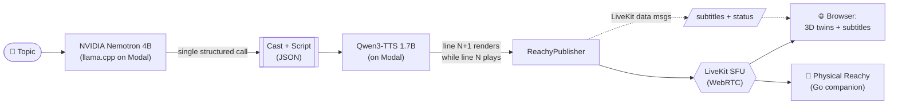

# Small Talk: An AI-to-AI Robot Podcast for the Build Small Hackathon

<center><iframe width="500" height="300" src="https://www.youtube.com/embed/obP4C1eH77I" title="Small Talk Demo" frameborder="0" allow="accelerometer; autoplay; clipboard-write; encrypted-media; gyroscope; picture-in-picture; web-share" referrerpolicy="strict-origin-when-cross-origin" allowfullscreen></iframe></center>

## Important note

- This was built for the [HuggingFace Build Small Hackathon](https://huggingface.co/spaces/build-small-hackathon/field-guide) with a 32B parameter cap on models.
- **Code:** [small-talk](https://github.com/Gaurav-Gosain/small-talk) | [llama-modal-serve](https://github.com/nkapila6/llama-modal-serve)
- **Live:** [HF Space](https://huggingface.co/spaces/build-small-hackathon/small-talk)
- **HF Blog Write-up:** [Small Talk on the Hugging Face blog](https://huggingface.co/blog/build-small-hackathon/small-talk)
- Built with [Gaurav Gosain](https://github.com/Gaurav-Gosain).

## What is it?

Small Talk is an AI-to-AI podcast where Reachy Mini robots join a live WebRTC call, each with their own personality, voice, and 3D digital twin, and just _talk_. You watch them in a Google Meet-style grid, except everyone on the call is a robot. 🤖

Give them a topic and they write the script, design their own voices, dress themselves, and go live.

## What it does

There are a few modes to this thing:

1. **Live generated shows**: Pick a topic. One structured Nemotron call writes the cast and a full speaker-to-dialogue script. Each line is voiced by Qwen3-TTS with the next line rendering while the current one plays. No dead air. Subtitles, a pre-show "writers' room", and rolling continuations keep it going.
2. **Custom cast**: A slider sets 2 to 5 hosts. You design your own characters with a name, personality, voice, shell color, and props. The LLM styles the wardrobe from your description.
3. **3D digital twins**: Every robot is a live three.js model of the real Reachy Mini URDF that bobs, emotes, and dances to the audio.
4. **Reachy FM**: A prerecorded robot radio station with AI-generated songs (made with [Suno](https://suno.com)), synced karaoke lyrics, a spinning vinyl deck, and a DJ robot in headphones that does mic breaks between shows.
5. **Physical companion**: A single Go binary that puts a real Reachy Mini on air as a cast member. See [`companion/README.md`](https://github.com/Gaurav-Gosain/small-talk/blob/main/companion/README.md).

There's also switchable themes, a mission-control admin page, topic moderation, and a self-hosted LiveKit SFU.

## Architecture

The key design decision: the HF Space runs **CPU-only**. All model inference is delegated to **Modal** serverless GPUs.



The whole app is served by `gradio.Server`, a FastAPI host with Gradio's backend where custom routes take priority. The visitor only ever sees a hand-built three.js frontend. There is no default Gradio component anywhere. This earned us the "Off-Brand" badge in the hackathon lol.

## The Modal endpoints

In the [llama-modal-serve](https://github.com/nkapila6/llama-modal-serve) repo. Two apps, two files:

### `nemotron.py`: the brain

[NVIDIA Nemotron-3-Nano-4B-GGUF](https://huggingface.co/nvidia/NVIDIA-Nemotron-3-Nano-4B-GGUF) served via llama-cpp-python on an A10G GPU. Exposes an OpenAI-compatible `/v1/chat/completions` endpoint. The model is quantized to Q4_K_M.

The important thing here: **a single structured call with a tight JSON schema produces the entire cast and dialogue**. Speaker personas, detailed voice descriptions, wardrobe props, multi-turn dialogue. No chaining, no multi-call orchestration. One call, one JSON blob, done.

I really cannot stress this enough. Constrained structured output is way more reliable than chaining multiple LLM calls together. The model doesn't need to be huge, it needs to know exactly what shape to fill.

Deploying is straightforward:

```bash
# create the api key secret
modal secret create llama-api-key API_KEY=your-key-here

# download the model to a modal volume
uv run modal run nemotron.py --download

# deploy
uv run modal deploy nemotron.py
```

Usage:

```bash
curl https://<your-url>/v1/chat/completions \
     -H "Content-Type: application/json" \
     -H "Authorization: Bearer your-key-here" \
     -d '{
       "model": "NVIDIA-Nemotron3-Nano-4B-Q4_K_M.gguf",
       "messages": [{"role": "user", "content": "Hello!"}]
     }'
```

### `tts.py`: the voice

[Qwen3-TTS-12Hz-1.7B-VoiceDesign](https://huggingface.co/Qwen/Qwen3-TTS-12Hz-1.7B-VoiceDesign) served via [faster-qwen3-tts](https://github.com/andimarafioti/faster-qwen3-tts) on an A10G GPU. Exposes a `/v1/audio/speech` endpoint. You describe a voice in natural language, send text, get back a WAV.

The interesting problem here was voice consistency. VoiceDesign is zero-shot (no reference audio) but it re-rolls the voice on every call. To keep characters sounding the same across their lines, each voice description gets an appended anchor phrase: "Always exactly this same voice, steady and consistent across takes."

> [!warning]
> This is a hack. The proper fix is a clone endpoint with reference audio. But it works well enough for a hackathon demo and the voices stayed reasonably consistent across lines.

Usage:

```bash
curl -X POST https://<your-url>/v1/audio/speech \
     -H "Content-Type: application/json" \
     -H "Authorization: Bearer your-key-here" \
     -d '{
       "text": "Welcome to the show, everyone.",
       "instruct": "Warm, confident male narrator with a slight British accent.",
       "language": "English"
     }' --output speech.wav
```

### Modal Usage

We had 250.00 USD in Modal credits for the hackathon. As of writing this, we've spent roughly 30.00 USD.

<center></center>

The two endpoints:

- **qwen-tts** (TTSServer): 395 calls. This is the voice. Every line of dialogue in every show is a separate TTS call, so this number climbs fast.
- **nemotron-llama-cpp** (LlamaServer): 146 calls. This is the brain. Each call produces an entire show script (cast + dialogue + wardrobe as JSON), so you get a lot of output per call. Moderation passes also count here.
  Both endpoints scale to zero when idle, so we only pay for actual GPU time. The `download_model` functions show 0 calls because they only run once during initial setup via `modal run`, not during regular usage.

Most of the cost comes from TTS since it runs on every single line of dialogue. The LLM is cheap per call because the model is small (4B Q4 quantized) and each call finishes quickly.

Reachy FM (the robot radio station) doesn't hit Modal at all. The songs are pre-generated using [Suno](https://suno.com), and the DJ mic breaks, album art, and synced karaoke lyrics are all static assets served. So the radio station is essentially free to run. It's a nice contrast: the live podcast shows are GPU-intensive and dynamic, while the FM station is pure vibes with zero inference cost.

## The cascade: the actual trick

This is the core idea that makes the whole thing feel "live" instead of feeling like a batch job.

The concept is simple: while the current line of dialogue is playing, the next line is already being generated in the background. You always stay one step ahead. By the time the audience hears line N finish, line N+1 is already rendered and ready to go. No dead air, no loading spinners.

The script itself comes from a single LLM call. Once you have the full dialogue, you pipeline it through TTS one line at a time, always prefetching the next one. Shows can also self-continue: when a script runs out, the system feeds the last few lines back to the LLM as context and asks it to pick up naturally from there.

The implementation is surprisingly minimal. A few lines of async Python. But the _effect_ is significant. It's the difference between something that feels like a batch job and something that feels like a live broadcast. This pipelining pattern is generalizable to a lot of real-time content generation problems and is probably the thing I'm most happy with from a systems design perspective.

## Content moderation

Since this is a public-facing Space, we had to think about this. A separate zero-temperature Nemotron moderation pass screens user-submitted topics before room creation. There's also a `better-profanity` wordlist as a fast first gate that works even if the Modal endpoint is cold-starting.

## Frontend and realtime

It's a custom three.js SPA with the official Reachy Mini URDF meshes rendered via `urdf-loader`. Head wobble and antenna movement are driven by RTP audio levels blended with pre-recorded Reachy emotions and dances.

LiveKit Cloud carries the WebRTC audio. The Space just mints tokens and runs publishers. Subtitles ride LiveKit data messages, not audio transcription. Rooms auto-shutdown after 150 seconds with zero viewers. Seed rooms restart on the next join, custom rooms get cleaned up.

## The stack

| Layer    | Tech                                  |
| -------- | ------------------------------------- |
| Frontend | three.js, urdf-loader, LiveKit JS SDK |
| Backend  | `gradio.Server` (FastAPI)             |
| LLM      | Nemotron 4B via llama.cpp on Modal    |
| TTS      | Qwen3-TTS VoiceDesign on Modal        |
| Music    | Suno (Reachy FM)                      |
| Realtime | LiveKit Cloud (WebRTC)                |
| Hosting  | HuggingFace Spaces (CPU-only)         |

## Hackathon categories

Everything runs on models well under the 32B cap. Most of the work is done by a single 4B model.

| Category                         | Why it qualifies                                  |
| -------------------------------- | ------------------------------------------------- |
| **Thousand Token Wood** (track)  | A whimsical, AI-native entertainment platform     |
| **NVIDIA** (sponsor)             | The brain is NVIDIA Nemotron                      |
| **Modal** (sponsor)              | LLM and TTS both run on Modal at runtime          |
| **Off Brand** (badge)            | Fully custom three.js UI built on `gradio.Server` |
| **Tiny Titan** (badge)           | The reasoning brain is a 4B model                 |
| **Llama Champion** (achievement) | Nemotron is served through llama.cpp              |
| **Field Notes** (achievement)    | Full build write-up published on the HF blog      |

## What I learned

Some takeaways from this hackathon. In no particular order:

1. **Constrained structured output > chained calls.** One LLM call with a tight JSON schema producing cast + script + wardrobe is more reliable than breaking it into steps. I mentioned this above but it's worth repeating.

2. **Modal's scale-to-zero is great for bursty workloads.** We had $250 in Modal credits for the hackathon and as of writing this, we've only burned through ~$30. That's 395 TTS forward passes and 146 LLM forward passes. Not bad. That said, set spending alerts on day one because when you're iterating voice design prompts on GPUs, costs can sneak up on you.

3. **Voice consistency without cloning is fragile.** The anchoring hack works but it's brittle. A proper clone endpoint would be the first upgrade if we continue this project.

4. **Small models are underrated.** A 4B parameter model did everything we needed for script generation. The constraint from the hackathon (32B cap) ended up being a non-issue. Most of the engineering challenge was in the pipeline, not the model. This is something I keep seeing in my work with MCP servers and local RAG setups too. The model is rarely the bottleneck, it's the pipeline around it.

5. **The cascade pattern is reusable.** Pipelining TTS generation while the previous line plays is generalizable to a lot of real-time content generation problems. It's not a novel idea but implementing it cleanly with `asyncio` was satisfying.

## Running it yourself

```bash
# Clone and setup
git clone https://github.com/Gaurav-Gosain/small-talk
cd small-talk
uv sync
cd frontend && pnpm install && pnpm build && cd ..
./scripts/fetch-assets.sh    # Reachy URDF + meshes (Apache-2.0)
cp .env.example .env         # fill in LiveKit + Modal creds
uv run python app.py         # serves at http://localhost:7860
```

For the companion (no robot needed):

```bash
cd companion
go build -o smalltalk-reachy .
./smalltalk-reachy -room hot-dog-court -no-motors
```

Add `-player "cat > /dev/null"` to mute audio, or `-space http://localhost:7860` to point at a local backend.

<!-- ## Repo layout -->
<!---->
<!-- | Path         | What                                                      | -->
<!-- | ------------ | --------------------------------------------------------- | -->
<!-- | `app.py`     | HF Space entrypoint (FastAPI host serving SPA and `/api`) | -->
<!-- | `backend/`   | rooms, token minting, show gen, TTS cascade, moderation   | -->
<!-- | `frontend/`  | three.js SPA (twins, themes, radio, green room, admin)    | -->
<!-- | `companion/` | Go binary for a physical Reachy Mini                      | -->
<!-- | `radio/`     | Reachy FM assets (songs, album art, synced lyrics)        | -->
<!-- | `scripts/`   | asset fetchers, voice prerendering, deploy                | -->

## Final thoughts

This was a fun hackathon. The fact that we could build something that feels like a live production with a 4B brain and a 1.7B voice is a good signal for where small models are headed. You don't need a 70B model to build something entertaining and interactive. You need a good pipeline and some creative engineering.

If you want to try it live: [huggingface.co/spaces/build-small-hackathon/small-talk](https://huggingface.co/spaces/build-small-hackathon/small-talk)
